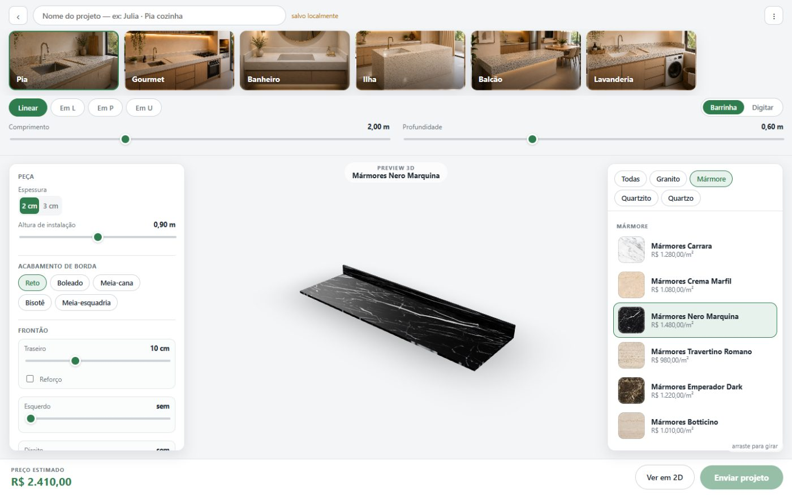
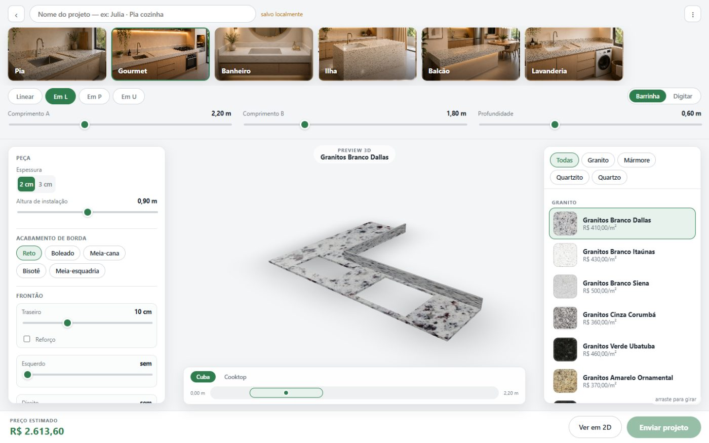
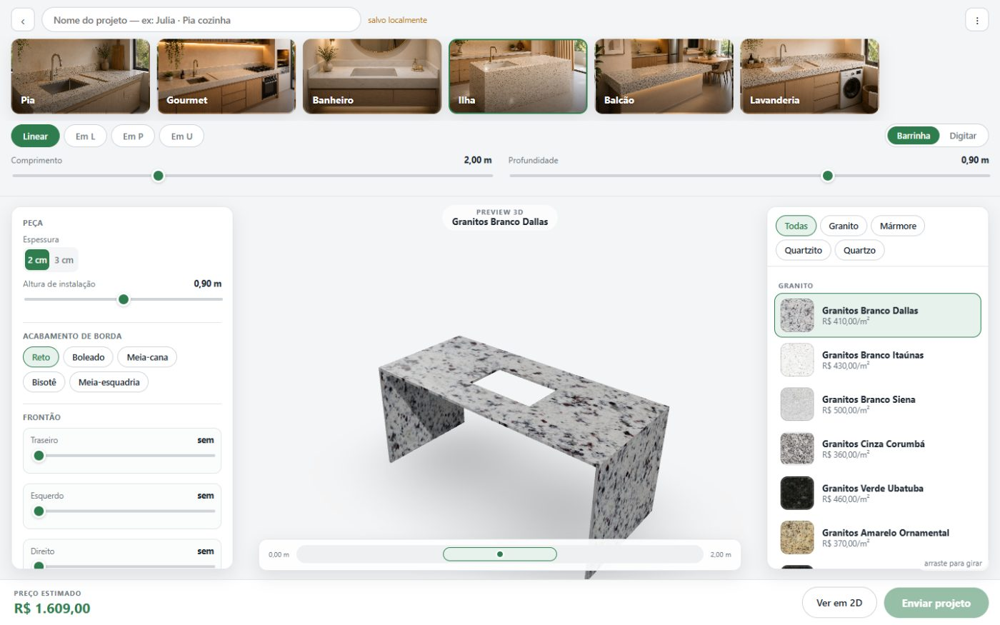

<div align="center">

# DF Mármores — Projeto e Orçamento

**Monte a bancada com o cliente, veja em 3D e feche o orçamento na hora.**

Web app do vendedor da marmoraria: desenha a peça com medidas reais, mostra em
3D com a pedra escolhida e calcula o preço final — funcionando offline, na casa
do cliente.



</div>

---

## O que faz

- **Ambientes** — Pia, Gourmet, Banheiro, Ilha, Balcão, Lavanderia. Cada um já
  monta o formato certo: pia com o furo da cuba, ilha com as laterais de pedra
  descendo até o piso, gourmet em L com cuba e cooktop.
- **Medidas** — Linear / Em L / Em P / Em U, com sliders ou digitando. O 3D e o
  desenho 2D atualizam ao vivo.
- **Pedras** — 25 materiais em 4 famílias (granito, mármore, quartzito, quartzo),
  com foto real da chapa aplicada na peça inteira.
- **Componentes nos mínimos detalhes** — frontão e saia por lado, cuba (modelo,
  formato, posição lateral e fundo↔frente), cooktop, furos. Régua abaixo do 3D
  para arrastar cada recorte ao longo da peça.
- **Orçamento ao vivo** — por retângulo envolvente da chapa, borda acabada,
  recortes, complementos e instalação. Custo e margem só aparecem para o
  vendedor; o modo apresentação esconde tudo isso quando a tela vira pro cliente.
- **Documentos** — proposta comercial e ordem de serviço para a oficina, prontos
  para imprimir ou salvar em PDF (o mesmo projeto, views diferentes).
- **Offline** — tudo grava no navegador (IndexedDB). Sem internet, continua
  funcionando.

<table>
  <tr>
    <td></td>
    <td></td>
  </tr>
</table>

## Stack

| Camada | Escolha |
|---|---|
| Base | React 19 + Vite 7 + TypeScript |
| 3D | Three.js + React Three Fiber (`ExtrudeGeometry` da mesma geometria 2D) |
| 2D | SVG puro (imprime vetorial na proposta) |
| Estado | Zustand |
| Offline | Dexie (IndexedDB) + PWA |
| Documentos | HTML + `@media print` |
| Backend (opcional) | Supabase |
| Deploy | Vercel |

## Desenvolvimento

Precisa de **Node 20+**.

```bash
npm install
npm run dev        # http://localhost:5173
npm run build      # typecheck + build de produção (dist/)
npm run preview    # serve o build
```

Sem `.env.local` o app roda 100% local — que é o cenário da casa do cliente.
Para ligar o Supabase depois:

```bash
cp .env.example .env.local   # e preencher VITE_SUPABASE_URL / VITE_SUPABASE_ANON_KEY
```

## Deploy na Vercel

1. Importe o repositório na Vercel (framework: **Vite**, detecta sozinho).
2. O `vercel.json` já redireciona todas as rotas para o `index.html`, então
   `/editor`, `/proposta` etc. não dão 404 ao recarregar.
3. Se for usar Supabase, cadastre as variáveis `VITE_SUPABASE_URL` e
   `VITE_SUPABASE_ANON_KEY` no painel do projeto — nunca no código.

## Como está organizado

O coração é **um modelo de dados só** ([`src/domain/project.ts`](src/domain/project.ts)).
2D, 3D, orçamento, proposta e ordem de serviço são todos *views* dele.
**Toda medida é milímetro inteiro**; a conversão para centímetro mora só em
[`src/domain/units.ts`](src/domain/units.ts) e nos campos de entrada.

```
src/
  domain/
    project.ts        o objeto Projeto — a fonte única
    presets.ts        defaults + montagem de cada ambiente
    geometry.ts       JSON → contorno, bordas de parede, posição dos recortes
    quote.ts          orçamento por retângulo envolvente
    catalogo.ts       25 pedras (nome, preço, família, textura)
    stoneTexture.ts   textura de pedra procedural (fallback sem foto)
    tabelaPrecos.ts   tabela de preços padrão (editável no admin)
  store/projectStore.ts   estado (Zustand) + gravação no Dexie
  components/
    Configurador.tsx  layout do configurador
    Scene3D.tsx       cena Three.js
    Drawing2D.tsx     desenho SVG com cotas
    DimensionBar.tsx  formato + sliders de medida
    AmbienteStrip.tsx faixa de ambientes
    PositionRuler.tsx régua de posição arrastável
    paineis.tsx       painel de características + catálogo de pedras
  pages/
    Projetos.tsx      lista inicial (busca por cliente)
    Proposta.tsx      proposta comercial (impressão)
    OrdemServico.tsx  ordem de serviço da oficina
    Precos.tsx        admin da tabela de preços
public/
  ambientes/          fotos dos ambientes
  chapas/             fotos das chapas (ver LISTA.md)
```

## Fotos das chapas

As pedras usam foto real quando existe `public/chapas/<id>.jpg`, senão caem numa
textura desenhada por código. A lista dos nomes de arquivo está em
[`public/chapas/LISTA.md`](public/chapas/LISTA.md). É só soltar o arquivo na
pasta — nenhuma mudança de código.

## Em evolução

Próximas entregas previstas: envio da proposta pelo WhatsApp, exportação de
projetos para backup, sincronização em nuvem, visualização em realidade
aumentada e ajuste fino de escala 1:1 na tela.

---

<div align="center">
<sub>DF Mármores e Granitos</sub>
</div>
